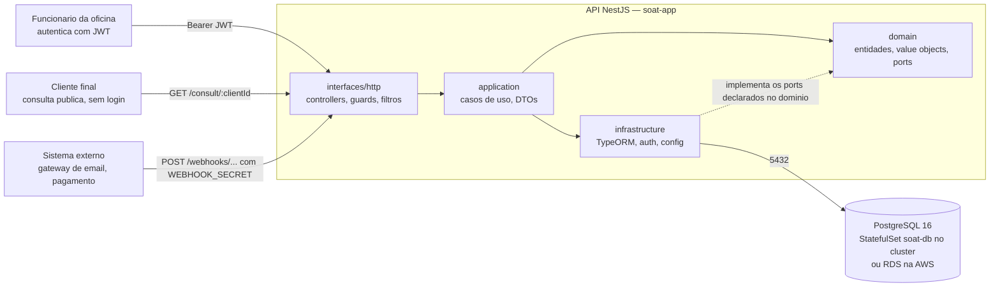
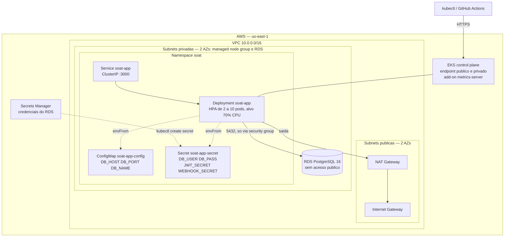
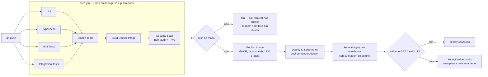

# Auto Repair Shop OS Management System

[](https://github.com/gomes-leonardo/fiap-software-architecture/actions/workflows/ci-cd.yml)

Sistema de gerenciamento de ordens de servico para oficina mecanica — SOAT Tech Challenge (POS TECH FIAP).

A Fase 1 entregou o MVP: dominio em camadas, CRUDs, maquina de status da OS, orcamento com preco congelado, Docker e CI. A Fase 2 leva esse MVP para um cluster Kubernetes provisionado por Terraform, com pipeline de CI/CD que publica a imagem e faz o deploy sozinho.

## Integrantes

| Nome | RM |
| --- | --- |
| Vinicius Taked Souza Brunelli | rm374460 |
| Leonardo Rodrigues Gomes | rm374461 |

## Video demonstrativo

**[Assistir no YouTube](https://www.youtube.com/watch?v=dXYspEFJsoQ)**

Roteiro: arquitetura → deploy da aplicacao → execucao do pipeline CI/CD → consumo das APIs → escalabilidade automatica com o HPA escalando ao vivo.

## Fase 2 — Objetivos

O que mudou em relacao a Fase 1, e onde ver cada coisa:

| Objetivo | O que foi feito | Onde |
| --- | --- | --- |
| **Rodar em Kubernetes** | Namespace `soat`, Deployment da API, StatefulSet do Postgres com PVC, Services, ConfigMap, Secret e HPA de 2 a 10 pods | [`k8s/`](k8s/README.md) |
| **Infraestrutura como codigo** | Terraform com dois caminhos completos: EKS + RDS na AWS, e cluster Kind local com `metrics-server` | [`infra/`](infra/README.md) |
| **Escalabilidade automatica** | HPA `autoscaling/v2` com alvo de 70% de CPU, `requests.cpu` declarada nos pods e `metrics-server` provisionado pelo Terraform | [`k8s/app-hpa.yaml`](k8s/app-hpa.yaml) |
| **CI/CD com deploy** | O `ci.yml` virou `ci-cd.yml`: publica a imagem no GHCR e aplica os manifestos no cluster, com rollback automatico se o rollout falhar | [`.github/DEPLOYMENT.md`](.github/DEPLOYMENT.md) |
| **Gate de smoke test** | `npm run test:smoke` sobe o `AppModule` real contra um Postgres de Testcontainers e verifica o caminho critico por HTTP, antes de qualquer build de imagem | `test/smoke/` |
| **Exclusao logica** | Todas as entidades passaram a ter `deleted_at`. `DELETE` deixou de apagar linha, e os indices unicos viraram parciais para nao travar o valor de um registro excluido | [Exclusao logica](#exclusao-logica) |
| **Aprovacao de orcamento por canal externo** | `POST /webhooks/budgets/:id/approve` e `/refuse`, para a decisao do cliente final chegar sem login | [Webhooks](#webhooks-de-integracao-sem-login-de-usuario) |
| **Documentacao de API versionada** | Spec OpenAPI e collection do Postman geradas do proprio codigo | [`docs/`](docs/README.md) |
| **Relatorio de seguranca com evidencia** | `npm audit`, Trivy e Semgrep executados de verdade, com os outputs brutos versionados | [`SECURITY.md`](SECURITY.md) |

## Arquitetura

### Componentes



A seta tracejada e a inversao de dependencia: o dominio declara os contratos de repositorio e nao importa TypeORM, NestJS nem nada de framework. Quem depende e a infraestrutura.

### Infraestrutura

O alvo de producao e a AWS. O mesmo Deployment, Service e HPA rodam sem alteracao num cluster Kind local — muda o banco, que ali e o StatefulSet dos manifestos em vez do RDS.



Duas escolhas que o desenho nao explica sozinho:

- **O RDS nao tem endereco publico.** O security group dele tem uma unica regra de entrada: porta 5432 a partir do security group dos nodes do EKS. Nada fora do cluster alcanca o banco.
- **O Terraform para onde os manifestos comecam.** Ele entrega VPC, cluster, banco gerenciado e `metrics-server`. Deployment, Service, HPA, ConfigMap e Secret sao do `k8s/`, aplicados depois do `terraform apply`. O contrato entre os dois — nomes de objeto, quem cria o que — esta em [`infra/README.md`](infra/README.md).

### Fluxo de deploy



A tag por SHA nao e decorativa: o Deployment usa `imagePullPolicy: IfNotPresent`, entao uma tag fixa como `latest` faria o kubelet reaproveitar a imagem em cache e nunca puxar a versao nova.

### Camadas

Monolito NestJS com **Domain-Driven Design**:

```
src/
  domain/          -> Entidades, Value Objects, regras de negocio (zero imports de framework)
  application/     -> Casos de uso, DTOs, orquestracao
  infrastructure/  -> TypeORM entities, implementacoes de repositorio, auth, config
  interfaces/http/ -> Controllers, guards, filtros, modules
```

### Principios aplicados

- **Inversao de Dependencia (SOLID - D):** O dominio define contratos (classes abstratas como `ClientRepository`). A infraestrutura implementa. O dominio nunca importa TypeORM, NestJS ou qualquer framework.
- **Entidades ricas:** Regras de negocio vivem nas entidades, nao nos controllers ou use cases. Ex: a `ServiceOrder` valida suas proprias transicoes de status.
- **Value Objects imutaveis:** `CpfCnpj`, `Plate`, `BudgetLine` validam-se na criacao e nao mudam depois.
- **Price Freezing:** O orcamento congela precos no momento da criacao, protegendo o cliente de alteracoes posteriores no catalogo.
- **Repository Port pattern:** Classes abstratas no dominio, implementacoes concretas na infraestrutura, bind via modulo NestJS.

### Justificativa do banco de dados

**PostgreSQL 16** foi escolhido por:

- **JSONB nativo:** Usado para historico de status da OS (`status_history`) e linhas do orcamento (`lines`), evitando tabelas auxiliares para dados que sao sempre lidos em conjunto
- **Transacoes ACID:** Essencial para operacoes de estoque (decremento atomico) e consistencia entre orcamento e OS
- **Tipos ricos:** UUID como PK, DECIMAL(10,2) para valores monetarios, indices unicos parciais (CPF/CNPJ, placa, SKU) que convivem com a exclusao logica
- **Maturidade:** Ecossistema estavel com TypeORM 0.3, suporte a locking otimista/pessimista

Alternativas consideradas:

- **MySQL:** Suporte inferior a JSONB e UUIDs nativos
- **MongoDB:** Sem transacoes ACID multi-documento de forma simples, desnecessario para um dominio relacional
- **SQLite:** Insuficiente para concorrencia e producao

A mesma major (16) vale nos tres ambientes: `postgres:16-alpine` no docker-compose, `postgres:16-alpine` no StatefulSet do cluster e PostgreSQL 16 no RDS.

## Endpoints da API

Todos os endpoints (exceto `/auth`, `/consult`, `/health` e `/webhooks`) requerem autenticacao JWT via header `Authorization: Bearer <token>`.

### Autenticacao

| Metodo | Rota             | Descricao           |
| ------ | ---------------- | ------------------- |
| POST   | `/auth/register` | Registrar admin     |
| POST   | `/auth/login`    | Login (retorna JWT) |

### Clientes

| Metodo | Rota           | Descricao                                |
| ------ | -------------- | ---------------------------------------- |
| POST   | `/clients`     | Cadastrar cliente                        |
| GET    | `/clients`     | Listar clientes (filtro por `?cpfCnpj=`) |
| GET    | `/clients/:id` | Buscar por ID                            |
| PUT    | `/clients/:id` | Atualizar cliente                        |
| DELETE | `/clients/:id` | Excluir cliente (logico)                 |

### Veiculos

| Metodo | Rota                         | Descricao                  |
| ------ | ---------------------------- | -------------------------- |
| POST   | `/vehicles`                  | Cadastrar veiculo          |
| GET    | `/vehicles`                  | Listar veiculos            |
| GET    | `/vehicles/:id`              | Buscar por ID              |
| GET    | `/vehicles/client/:clientId` | Buscar veiculos do cliente |
| PUT    | `/vehicles/:id`              | Atualizar veiculo          |
| DELETE | `/vehicles/:id`              | Excluir veiculo (logico)   |

### Pecas (Estoque)

| Metodo | Rota               | Descricao             |
| ------ | ------------------ | --------------------- |
| POST   | `/parts`           | Cadastrar peca        |
| GET    | `/parts`           | Listar pecas          |
| GET    | `/parts/:id`       | Buscar por ID         |
| PUT    | `/parts/:id`       | Atualizar peca        |
| PATCH  | `/parts/:id/stock` | Ajustar estoque (+/-) |
| DELETE | `/parts/:id`       | Excluir peca (logico) |

### Servicos

| Metodo | Rota            | Descricao                |
| ------ | --------------- | ------------------------ |
| POST   | `/services`     | Cadastrar servico        |
| GET    | `/services`     | Listar servicos          |
| GET    | `/services/:id` | Buscar por ID            |
| PUT    | `/services/:id` | Atualizar servico        |
| DELETE | `/services/:id` | Excluir servico (logico) |

### Ordens de Servico

| Metodo | Rota                                             | Descricao                                                |
| ------ | ------------------------------------------------ | -------------------------------------------------------- |
| POST   | `/service-orders`                                | Criar OS (aceita `services` e `parts` inline)            |
| GET    | `/service-orders`                                | Listar OS ativas (filtro por `?status=` ou `?clientId=`) |
| GET    | `/service-orders/:id`                            | Buscar por ID                                            |
| PATCH  | `/service-orders/:id/status`                     | Alterar status                                           |
| PUT    | `/service-orders/:id`                            | Atualizar descricao                                      |
| DELETE | `/service-orders/:id`                            | Excluir OS (logico)                                      |
| GET    | `/service-orders/metrics/average-execution-time` | Tempo medio de execucao                                  |
| GET    | `/service-orders/metrics/operational-report`     | Relatorio operacional                                    |

Sem filtro, `GET /service-orders` retorna somente as OS ativas — as terminais (`FINALIZADA`, `ENTREGUE`, `ENCERRADA_SEM_EXECUCAO`) ficam de fora. A ordenacao segue a prioridade de status `EM_EXECUCAO` > `AGUARDANDO_APROVACAO` > `EM_DIAGNOSTICO` > `RECEBIDA` > `PAUSADO` e, dentro do mesmo status, da OS mais antiga para a mais recente. Os filtros `?status=` e `?clientId=` nao aplicam essa regra.

#### Abertura com servicos e pecas inline

`POST /service-orders` aceita `services` e `parts` opcionais, cada item com `referenceId` e `quantity`:

```json
{
  "clientId": "...",
  "description": "Revisao completa",
  "services": [{ "referenceId": "<id do servico>", "quantity": 1 }],
  "parts": [{ "referenceId": "<id da peca>", "quantity": 2 }]
}
```

Informando qualquer um deles, a OS nasce com um orcamento `PENDENTE` e ja em `AGUARDANDO_APROVACAO` — o mesmo estado a que se chega criando a OS e chamando `POST /budgets` em seguida. Sem itens, nada muda: OS em `RECEBIDA`, sem orcamento.

Preco e descricao **nunca** vem da requisicao: sao lidos do catalogo (`Service.basePrice` / `Part.unitPrice`) e congelados no orcamento. E o que impede um preco arbitrario de entrar e o que garante que o valor combinado nao muda depois se o catalogo mudar.

Dois campos na resposta merecem atencao:

- **`createdBudgetId`** — o orcamento que acabou de nascer. Nao confundir com **`budgetId`**, que continua `null`: aquele significa "orcamento APROVADO" e e o que destranca a transicao para `EM_EXECUCAO`. Quem o preenche e o `ApproveBudgetUseCase`, depois de dar baixa no estoque. Se a abertura o preenchesse, qualquer um abriria uma OS com pecas e iria direto para execucao, sem aprovacao e sem reserva.
- **`stockWarnings`** — peca com estoque insuficiente **nao** bloqueia a abertura. O estoque so e decrementado na aprovacao, e e la que a falta barra o fluxo; o aviso existe para o admin descobrir enquanto ainda da tempo de repor.

`referenceId` inexistente no catalogo responde `400` e **nao** cria nada — a resolucao acontece antes de qualquer escrita.

### Orcamentos

| Metodo | Rota                           | Descricao                  |
| ------ | ------------------------------ | -------------------------- |
| POST   | `/budgets`                     | Criar orcamento            |
| GET    | `/budgets/:id`                 | Buscar por ID              |
| GET    | `/budgets/service-order/:soId` | Listar orcamentos da OS    |
| PATCH  | `/budgets/:id/approve`         | Aprovar orcamento          |
| PATCH  | `/budgets/:id/refuse`          | Recusar orcamento          |
| DELETE | `/budgets/:id`                 | Excluir orcamento (logico) |

Os dois `PATCH` sao o canal **interno**, para o funcionario da oficina: exigem JWT. O equivalente **externo**, para a decisao do cliente final chegar sem login, esta em [Webhooks](#webhooks-de-integracao-sem-login-de-usuario).

### Consulta Publica (sem autenticacao)

| Metodo | Rota                      | Descricao                            |
| ------ | ------------------------- | ------------------------------------ |
| GET    | `/consult/:clientId?cpf=` | Consultar OS do cliente (valida CPF) |

> Protegido por **rate limiting** (fixed-window, 20 req/min por `clientId`) para mitigar abuso/forca-bruta no par `clientId` + CPF/CNPJ. Excedido o limite, responde `429 Too Many Requests` com header `Retry-After`.

### Health check

| Metodo | Rota      | Descricao                                    |
| ------ | --------- | -------------------------------------------- |
| GET    | `/health` | Estado da aplicacao e da conexao com o banco |

Responde `{"status":"ok","database":"connected"}`, ou `503` se o banco estiver inacessivel. O mesmo endpoint alimenta o `HEALTHCHECK` da imagem, as probes de liveness/readiness no Kubernetes e o smoke test pos-deploy do pipeline.

### Webhooks de Integracao (sem login de usuario)

| Metodo | Rota                                  | Descricao                                          |
| ------ | ------------------------------------- | -------------------------------------------------- |
| POST   | `/webhooks/service-orders/:id/status` | Atualizar status da OS a partir de sistema externo  |
| POST   | `/webhooks/budgets/:id/approve`       | Aprovar orcamento a partir de canal externo         |
| POST   | `/webhooks/budgets/:id/refuse`        | Recusar orcamento a partir de canal externo         |

Porta para sistemas que nao tem usuario no sistema — gateway de email, sistema de pagamento, portal do cliente. A autenticacao e por segredo pre-compartilhado, na variavel `WEBHOOK_SECRET`:

```bash
curl -X POST http://localhost:3000/webhooks/service-orders/<id>/status \
  -H "Authorization: Bearer $WEBHOOK_SECRET" \
  -H 'Content-Type: application/json' \
  -d '{"status":"EM_DIAGNOSTICO","changedBy":"gateway-email"}'
```

O segredo tambem pode ir no campo `token` do corpo, para integracoes que nao permitem customizar cabecalhos — mas prefira o header: corpo de requisicao costuma acabar em log de acesso e em dump de erro.

Tres pontos que valem saber:

- **Sem `WEBHOOK_SECRET` definida, o endpoint recusa toda chamada.** Falha fechada de proposito: comparar direto com a variavel de ambiente faria `undefined === undefined` liberar geral numa instalacao mal configurada.
- **A comparacao e de tempo constante**, sobre os digests SHA-256 dos dois lados. Comparar com `===` permitiria descobrir o segredo caractere a caractere pelo tempo de resposta.
- **A matriz de transicao continua valendo.** O webhook de status usa o mesmo `ChangeServiceOrderStatusUseCase` do endpoint autenticado: vir de fora nao compra o direito de pular etapa. Transicao ilegal responde `400`.

#### Canal externo x canal interno na decisao do orcamento

`POST /webhooks/budgets/:id/approve` e `PATCH /budgets/:id/approve` chegam no mesmo `ApproveBudgetUseCase`. A diferenca esta em **quem prova identidade**, nao no que acontece depois:

| | Canal interno | Canal externo |
| --- | --- | --- |
| Rota | `PATCH /budgets/:id/approve` e `/refuse` | `POST /webhooks/budgets/:id/approve` e `/refuse` |
| Quem usa | funcionario da oficina | cliente final, atraves de um sistema integrado |
| Credencial | JWT do admin, via `JwtAuthGuard` | `WEBHOOK_SECRET`, via `WebhookAuthGuard` |
| Efeito | aprovar da baixa no estoque e vincula o orcamento a OS; recusar encerra a OS sem execucao | identico |

```bash
curl -X POST http://localhost:3000/webhooks/budgets/<id>/approve \
  -H "Authorization: Bearer $WEBHOOK_SECRET"

curl -X POST http://localhost:3000/webhooks/budgets/<id>/refuse \
  -H "Authorization: Bearer $WEBHOOK_SECRET"
```

Compartilhar o caso de uso e deliberado. Um caminho externo que apenas trocasse o status do orcamento pularia a reserva de estoque e o vinculo com a OS: o orcamento ficaria `APROVADO` com o estoque intacto e a OS travada, sem poder entrar em `EM_EXECUCAO`.

Regras que valem nos dois canais: so um orcamento `PENDENTE` aceita decisao (`400` caso contrario), e estoque insuficiente bloqueia a aprovacao inteira, sem decrementar nada.

### Relatorio Operacional

O endpoint `GET /service-orders/metrics/operational-report` retorna:

- Quantidade de OS por status (RECEBIDA, EM_DIAGNOSTICO, etc.)
- Total de ordens de servico
- Pecas com estoque baixo (threshold <= 5 unidades)
- Tempo medio de execucao dos servicos finalizados (em minutos)
- Total de servicos finalizados contabilizados

## Maquina de Status da OS

```
Recebida -> Em diagnostico -> Aguardando aprovacao -> Em execucao -> Finalizada -> Entregue

Excecoes:
  Em execucao -> Aguardando aprovacao  (re-orcamento)
  Em execucao <-> Pausado              (pausa por estoque)
  Aguardando aprovacao -> Encerrada sem execucao (recusa do cliente)
```

**Regras de negocio:**

- A transicao para `EM_EXECUCAO` so e permitida se a OS tiver um orcamento aprovado (`budgetId` setado).
- A aprovacao do orcamento vincula o `budgetId` na OS, habilitando a transicao — mas nao a faz automaticamente. O mecanico decide quando iniciar a execucao.
- O congelamento de preco (`frozenUnitPrice`) garante que o valor acordado com o cliente e preservado mesmo que o catalogo mude depois.
- A baixa de estoque acontece **na aprovacao do orcamento**, como reserva das pecas para a OS. Antes de decrementar qualquer coisa, o caso de uso confere a disponibilidade de todas as pecas: faltando uma, a aprovacao inteira e recusada e o estoque fica intacto. Ajustes avulsos continuam possiveis por `PATCH /parts/:id/stock`.
- Re-orcamento: a partir de `EM_EXECUCAO`, o sistema permite voltar para `AGUARDANDO_APROVACAO` com um novo orcamento versionado.

## Exclusao logica

`DELETE` **nao apaga linha**. Todas as entidades tem `deleted_at` (`@DeleteDateColumn` do TypeORM); o repositorio faz `softDelete` e as consultas param de enxergar o registro. Um `GET` do mesmo ID responde `404`, como se ele nao existisse.

Duas consequencias que aparecem na pratica:

- **Os indices unicos sao parciais** (`WHERE deleted_at IS NULL`). Sem isso, uma linha excluida seguraria para sempre o CPF/CNPJ, a placa, o SKU, o nome do servico ou o e-mail — e o cliente que voltasse a oficina nao conseguiria se recadastrar.
- **A migration `AddSoftDelete`** adiciona a coluna e troca as constraints de unicidade existentes por esses indices parciais.

## Como executar

### Pre-requisitos

- Node.js 20+ (o CI roda em 24, exigencia do `testcontainers` 12)
- Docker e docker-compose

### Com Docker (recomendado para desenvolvimento)

```bash
# 1. Criar o .env a partir do template (obrigatorio: o compose falha se
#    DB_PASS ou JWT_SECRET nao estiverem definidas)
cp .env.example .env

# 2. Subir a stack
docker-compose up -d
```

A API estara disponivel em `http://localhost:3000` e o Swagger em `http://localhost:3000/api-docs`.

```bash
curl http://localhost:3000/health
```

### Desenvolvimento local

```bash
# 1. Instalar dependencias
npm install

# 2. Configurar variaveis de ambiente
cp .env.example .env

# 3. Subir apenas o PostgreSQL
docker-compose up -d db

# 4. Rodar em modo desenvolvimento
npm run start:dev
```

> O `.env` precisa existir antes de qualquer `docker-compose up`, inclusive do
> `up -d db` isolado: as credenciais deixaram de ser hardcoded no compose.

### Exposicao do banco

O Postgres do compose e publicado apenas em `127.0.0.1:5432` (controlado por
`DB_BIND_ADDRESS` no `.env`). Isso mantem o fluxo de desenvolvimento local
funcionando — `docker-compose up -d db` + `npm run start:dev` na maquina —
sem deixar o banco alcancavel pela rede. O app nao usa essa porta publicada:
ele fala com o servico `db` pela rede interna `soat-network`.

Este compose e voltado a desenvolvimento e demo. Em producao o banco nao sobe
por aqui — ele fica atras dos manifestos Kubernetes/Terraform, sem porta
publicada no host.

### Credenciais de admin (desenvolvimento)

```text
Email: admin@oficina.com
Senha: admin123
```

Para obter um JWT:

```bash
curl -X POST http://localhost:3000/auth/login \
  -H "Content-Type: application/json" \
  -d '{"email":"admin@oficina.com","password":"admin123"}'
```

## Deploy em Kubernetes

Os manifestos ficam em [`k8s/`](k8s/README.md) e sobem a stack inteira no namespace `soat`: StatefulSet do Postgres com PVC, Deployment da API com 2 replicas, Services, ConfigMap, Secret e o HPA de 2 a 10 pods.

**Pre-requisitos:** cluster 1.23+ (o HPA usa `autoscaling/v2`), `kubectl` apontando para ele e `metrics-server` instalado — sem o `metrics-server` o HPA fica em `<unknown>/70%` e nunca escala.

```bash
# 1. Build da imagem e disponibilizacao para os nodes.
#    Os manifestos usam imagePullPolicy: IfNotPresent, entao uma imagem local
#    basta — mas ela precisa estar no node, nao so na sua maquina.
docker build -t soat-tech-challenge:latest .
kind load docker-image soat-tech-challenge:latest      # ou: minikube image load ...

# 2. Aplicar tudo na ordem de dependencia
./k8s/apply-all.sh

# 3. Verificar
kubectl get all -n soat
kubectl get hpa soat-app -n soat       # TARGETS nao pode ficar em <unknown>/70%

# 4. Acessar (o Service e ClusterIP; nao ha IP externo por padrao)
kubectl port-forward -n soat svc/soat-app 3000:3000
curl http://localhost:3000/health
```

O `apply-all.sh` aplica namespace → Secret → ConfigMap → banco, **espera o Postgres aceitar conexoes**, sobe o app, espera o rollout e so entao cria o HPA. Aplicar tudo de uma vez com `kubectl apply -f k8s/` tambem converge no fim, mas passa por um `CrashLoopBackOff` que parece falha.

Para derrubar:

```bash
kubectl delete namespace soat        # apaga tambem o PVC do banco e, com ele, os dados
```

> **Segredos.** `k8s/app-secret.yaml` esta versionado com valores de exemplo (`change-me-*`) — base64 nao e criptografia. Para qualquer uso que nao seja demonstracao local, crie o Secret fora do Git; o comando esta em [`k8s/README.md`](k8s/README.md).

O passo a passo completo — instalacao do `metrics-server`, verificacao do PVC, **geracao de carga para demonstrar o HPA escalando**, diagnostico quando o HPA nao reage e a justificativa de cada manifesto — esta em **[`k8s/README.md`](k8s/README.md)**.

## Provisionamento com Terraform

[`infra/`](infra/README.md) tem dois caminhos completos e independentes, cada um com seu proprio `init`/`plan`/`apply`/`destroy`:

| Caminho | Root | Cluster | Banco | Custo |
| --- | --- | --- | --- | --- |
| **Local** | `infra/envs/local` | Kind, dentro do Docker | StatefulSet dos manifestos em `k8s/` | zero |
| **AWS** | `infra/envs/aws` | EKS com managed node group | RDS PostgreSQL 16 | ~US$ 185/mes em `dev` |

Terraform >= 1.6 ou OpenTofu >= 1.6 — a configuracao funciona nos dois, e onde os comandos abaixo dizem `terraform`, `tofu` serve igual.

### Local (Kind) — comece por aqui

```bash
cd infra/envs/local

terraform init
terraform plan
terraform apply

kubectl config use-context kind-soat-local
kubectl top nodes            # confirma que o metrics-server respondeu
```

Depois disso o cluster esta pronto para receber a aplicacao — o build da imagem, o `kind load` e o `./k8s/apply-all.sh` da secao anterior. Para derrubar:

```bash
terraform destroy
```

### AWS (EKS + RDS)

```bash
# Passo 1 — backend remoto de state (uma vez por conta AWS)
cd infra/bootstrap
cp terraform.tfvars.example terraform.tfvars
terraform init
terraform apply
terraform output -raw backend_hcl > ../envs/aws/backend.hcl

# Passo 2 — ambiente
cd ../envs/aws
cp terraform.tfvars.example terraform.tfvars
terraform init -backend-config=backend.hcl
terraform plan
terraform apply              # ~15-20 min: EKS e RDS sao lentos para nascer

# Passo 3 — acessar o cluster
aws eks update-kubeconfig --region us-east-1 --name soat-tech-challenge-dev-eks
kubectl get nodes
```

O **passo 4** — ligar os manifestos ao RDS, o que exige sobrescrever o `DB_HOST` do ConfigMap e montar o Secret a partir do Secrets Manager — esta detalhado em [`infra/README.md`](infra/README.md). Na AWS os manifestos de banco (`db-deployment.yaml`, `db-service.yaml`) **nao** sao aplicados.

```bash
terraform destroy            # o EKS cobra por hora ligada mesmo sem pod nenhum
```

O README de `infra/` traz ainda os diagramas dos dois ambientes, a tabela de variaveis e outputs, os perfis `dev`/`prod`, a estimativa de custo item a item e as limitacoes conhecidas: **[`infra/README.md`](infra/README.md)**.

## CI/CD

O pipeline vive em `.github/workflows/ci-cd.yml` e roda em todo push e todo pull request contra a `main`:

| Job | Roda em | O que faz |
| --- | --- | --- |
| `Lint` | PR e main | `npm run lint` |
| `Typecheck` | PR e main | `npx tsc --noEmit` |
| `Unit Tests` | PR e main | suite unitaria + gate de 80% de cobertura em `src/domain` |
| `Integration Tests` | PR e main | suite de integracao contra Postgres de servico |
| `Smoke Tests` | PR e main | `npm run test:smoke` — sobe o `AppModule` real |
| `Build Docker Image` | PR e main | build da imagem, exportada como tarball |
| `Security Scan` | PR e main | `npm audit` + Trivy sobre o tarball |
| `Publish Image` | **so main, push** | publica no GHCR com as tags `sha-<7 primeiros>` e `latest` |
| `Deploy to Kubernetes` | **so main, push** | aplica os manifestos de `k8s/` no cluster |

Nenhum pull request publica imagem nem toca em cluster. Se o rollout estourar o timeout, a imagem em execucao divergir da esperada ou o `GET /health` pos-deploy falhar, o job imprime o diagnostico da revisao quebrada e roda `kubectl rollout undo`.

### Onde configurar os secrets

Em **Settings → Secrets and variables → Actions** do repositorio, ou pelo `gh`:

| Secret | Obrigatorio | Para que |
| --- | --- | --- |
| `KUBECONFIG_BASE64` | para deployar | acesso ao cluster de destino |
| `DB_PASS` | recomendado | sobrescreve `DB_PASS` em `soat-app-secret` |
| `JWT_SECRET` | recomendado | sobrescreve `JWT_SECRET` em `soat-app-secret` |
| `WEBHOOK_SECRET` | recomendado | sobrescreve `WEBHOOK_SECRET` em `soat-app-secret` |
| `GITHUB_TOKEN` | automatico | login no GHCR — **nao precisa cadastrar** |

```bash
# macOS (o base64 do BSD nao tem -w; no Linux use base64 -w0)
gh secret set KUBECONFIG_BASE64 --repo gomes-leonardo/fiap-software-architecture \
  --body "$(base64 -i ~/.kube/config | tr -d '\n')"

gh secret set DB_PASS --repo gomes-leonardo/fiap-software-architecture \
  --body "$(openssl rand -base64 32)"
gh secret set JWT_SECRET --repo gomes-leonardo/fiap-software-architecture \
  --body "$(openssl rand -base64 48)"
gh secret set WEBHOOK_SECRET --repo gomes-leonardo/fiap-software-architecture \
  --body "$(openssl rand -base64 48)"
```

> **Cadastre `DB_PASS` antes do primeiro deploy.** O Postgres so le `POSTGRES_PASSWORD` no `initdb`, isto e, no primeiro boot do StatefulSet. Trocar depois exige `ALTER USER` no banco ou apagar o PVC.

Sem `KUBECONFIG_BASE64` o job de deploy **nao falha**: o preflight escreve um aviso no summary e os passos seguintes sao pulados. Quem clona o repositorio nao tem cluster nenhum, e um deploy vermelho por configuracao ausente pintaria a `main` de falha sem haver nada errado com o codigo. Lint, tipos, testes, imagem e scan continuam bloqueando normalmente.

Detalhes de cada job, a escolha do GHCR, a visibilidade do pacote, o environment `production` com aprovacao manual, a ordem exata do deploy e o mecanismo de rollback: **[`.github/DEPLOYMENT.md`](.github/DEPLOYMENT.md)**.

## Testes

```bash
npm run test:unit           # unitarios
npm run test:integration    # integracao (requer Docker para testcontainers)
npm run test:smoke          # smoke: sobe o AppModule real e bate nos endpoints por HTTP
npm test                    # tudo
npm run test:cov            # cobertura
```

| Suite | Onde | O que cobre |
| --- | --- | --- |
| Unitarios | `test/unit/` | entidades de dominio, value objects, casos de uso, guards |
| Integracao | `test/integration/` | persistencia real contra Postgres de Testcontainers — soft delete, indices parciais, decisao de orcamento |
| Smoke | `test/smoke/` | a aplicacao inteira subindo: `AppModule` real, conexao com o banco, login e o caminho critico por HTTP |

As tres rodam no pipeline antes de qualquer build de imagem, e o job de unitarios impoe um gate de 80% de cobertura em `src/domain`.

O smoke test nao cobre regra de negocio — isso e trabalho das outras duas suites. Ele responde a unica pergunta que importa antes de um deploy: **subiu e responde?** Por isso as assercoes ficam no status HTTP e no formato minimo da resposta.

## Documentacao da API

| Recurso | Onde |
| --- | --- |
| Swagger UI | `http://localhost:3000/api-docs`, com a aplicacao rodando |
| Spec OpenAPI servido em runtime | `http://localhost:3000/api-docs-json` |
| Spec OpenAPI versionado | [`docs/swagger.json`](docs/swagger.json) |
| Collection do Postman | [`docs/postman-collection.json`](docs/postman-collection.json) |

Os dois arquivos de `docs/` sao **gerados a partir do proprio codigo** — nao edite nenhum dos dois:

```bash
npm run docs:api
```

Nao precisa de banco nem de variaveis de ambiente: o gerador monta o grafo de modulos do Nest so para ler os metadados dos controllers. E um snapshot, entao regere e commite junto sempre que um endpoint mudar de assinatura.

Como importar a collection, quais variaveis preencher (`base_url`, `token`, `webhook_secret`) e de onde vem os exemplos: [`docs/README.md`](docs/README.md).

## Seguranca

Relatorio completo de vulnerabilidades, com os outputs brutos de `npm audit`, Trivy e Semgrep versionados em `docs/security/`: **[SECURITY.md](SECURITY.md)**.

Medidas implementadas:

- Autenticacao JWT com Passport
- Senhas hasheadas com bcrypt (salt rounds = 10)
- ValidationPipe global com whitelist
- DomainExceptionFilter (sem vazamento de stack traces)
- Webhooks com segredo pre-compartilhado, comparado em tempo constante e com falha fechada quando `WEBHOOK_SECRET` nao esta definida
- Rate limiting no endpoint publico de consulta
- Dockerfile com usuario nao-root, versao de base fixada e `tini` como PID 1
- `.dockerignore` mantendo `.git`, `.env`, testes e node_modules fora da imagem
- Credenciais fora do versionamento (docker-compose le do `.env`, sem defaults para `DB_PASS` e `JWT_SECRET`)
- Postgres publicado apenas em loopback e servicos isolados na `soat-network`
- Na AWS: RDS sem endereco publico, storage criptografado, senha gerada por Terraform e guardada no Secrets Manager, nodes em subnet privada
- Scan de dependencias e de imagem (`npm audit` + Trivy) rodando no pipeline a cada push e pull request
