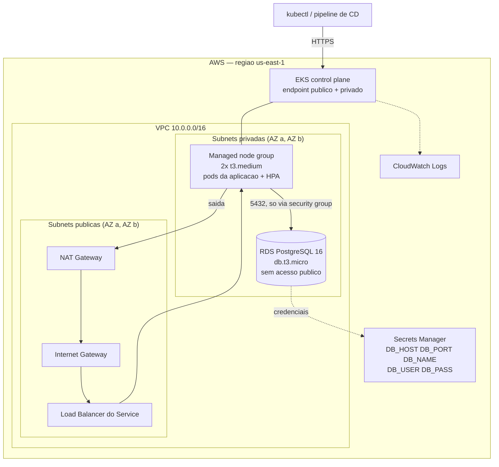
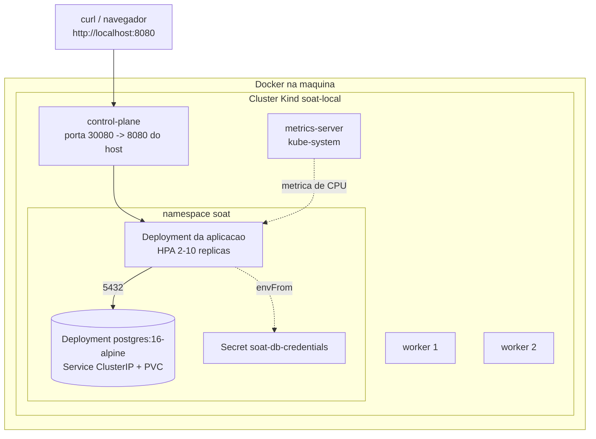

# Infraestrutura (Terraform)

Provisionamento do cluster Kubernetes e do banco de dados do SOAT Tech Challenge — Fase 2.

Existem **dois caminhos completos e independentes**:

| Caminho | Root | Cluster | Banco | Custo |
| --- | --- | --- | --- | --- |
| **AWS** | `envs/aws` | EKS com managed node group | RDS PostgreSQL 16 | pago (ver [Custo](#custo-estimado)) |
| **Local** | `envs/local` | Kind, dentro do Docker | PostgreSQL como Deployment no cluster | zero |

Os dois compartilham nada do estado um do outro: cada um tem seu proprio `init`, `plan`, `apply` e `destroy`. O caminho local existe para demonstrar a aplicacao e o HPA escalando sem gastar com AWS; o caminho AWS e a entrega de infraestrutura de verdade.

---

## Estrutura

```
infra/
  README.md
  bootstrap/                  # cria o backend remoto (S3 + DynamoDB). Roda uma vez.
    main.tf  variables.tf  outputs.tf  terraform.tfvars.example
  modules/
    network/                  # VPC, subnets publicas/privadas, IGW, NAT, rotas
    k8s/                      # EKS: control plane, OIDC, node group, add-ons
    database/                 # RDS PostgreSQL, subnet group, SG, Secrets Manager
  envs/
    aws/                      # raiz do ambiente AWS (dev | prod)
      main.tf  variables.tf  outputs.tf  providers.tf
      terraform.tfvars.example  backend.hcl.example
    local/                    # raiz do ambiente local (Kind)
      main.tf  variables.tf  outputs.tf  providers.tf
      terraform.tfvars.example
```

### Por que `envs/` em vez de um `main.tf` na raiz de `infra/`

A issue sugeria `infra/main.tf` unico. Dois ambientes com providers diferentes (`aws` de um lado, `kind`/`kubernetes`/`helm` do outro) e backends diferentes (S3 remoto vs. local) nao cabem numa raiz so: `terraform init` e por diretorio, e um `count = 0` em metade dos recursos ainda obriga o outro provider a ser configurado. Cada ambiente virou um root proprio, e o que e comum vive em `modules/`, que e onde o reuso realmente acontece.

---

## Diagrama

### AWS



O security group do RDS tem **uma unica regra de entrada**: porta 5432 a partir do security group que o EKS anexa aos nodes. Nao ha CIDR liberado nem endereco publico — nada fora do cluster alcanca o banco.

### Local (Kind)



O `metrics-server` esta aqui de proposito: o Kind nao o inclui, e **sem ele o HPA fica preso em `<unknown>` e nunca escala**. E a diferenca entre gravar o video da demonstracao e ficar olhando para um HPA parado.

---

## Recursos criados e justificativa

### `modules/network` (AWS)

| Recurso | Por que |
| --- | --- |
| `aws_vpc` | Isolamento de rede. DNS hostnames ligado porque o endpoint do RDS so resolve pelo DNS privado da VPC. |
| Subnets publicas (2 AZs) | Onde ficam o Load Balancer de entrada e o NAT. Recebem as tags `kubernetes.io/role/elb` — sem elas um Service `LoadBalancer` nao encontra onde colocar o ELB. |
| Subnets privadas (2 AZs) | Nodes do EKS e RDS. Nenhum deles recebe IP publico. Duas AZs sao o minimo que o EKS e o DB subnet group exigem. |
| `aws_internet_gateway` | Entrada e saida das subnets publicas. |
| `aws_nat_gateway` + `aws_eip` | Saida da internet para os nodes privados (pull de imagem, chamadas a API da AWS) sem expor entrada. Em `dev` e um so (~US$ 33/mes); em `prod`, um por AZ. |
| Tabelas de rota | Publica aponta para o IGW, privadas para o NAT. |

### `modules/k8s` (AWS)

| Recurso | Por que |
| --- | --- |
| `aws_eks_cluster` | Control plane gerenciado. Endpoint publico **e** privado: o publico e o que permite `kubectl` e o pipeline de CD chegarem de fora da VPC. |
| `aws_eks_node_group` | Managed node group em subnets privadas. `dev` = 2x `t3.medium` (max 4), `prod` = 3x `t3.large` (max 10). O `desired_size` entra em `ignore_changes` — depois do primeiro apply quem manda no numero de nodes e o autoscaler, nao o Terraform. |
| Roles IAM (cluster e node) | Politicas gerenciadas da AWS. A do ECR e **somente leitura**: o node baixa imagem, nunca publica. |
| `aws_iam_openid_connect_provider` | Habilita IRSA (ServiceAccount assumindo role IAM). Nada neste modulo usa, mas criar depois obriga a recriar toda role que dependa dele. |
| `aws_eks_addon` | `vpc-cni`, `coredns`, `kube-proxy` e **`metrics-server`**. O ultimo e pre-requisito do HPA. |
| `aws_cloudwatch_log_group` | O EKS cria este log group sozinho, com retencao infinita. Criando aqui, a retencao fica controlada (7 dias em dev, 30 em prod). |

### `modules/database` (AWS)

| Recurso | Por que |
| --- | --- |
| `aws_db_instance` | PostgreSQL 16, a mesma major do `postgres:16-alpine` do `docker-compose.yml`. `db.t3.micro` single-AZ em dev; `db.t3.small` Multi-AZ em prod. Storage sempre criptografado. |
| `aws_db_subnet_group` | Prende a instancia as subnets privadas. |
| `aws_security_group` + regra de entrada | Porta 5432 a partir do security group dos nodes do EKS, e so. |
| `random_password` | A senha e **gerada**, nunca escrita em `.tf` ou `.tfvars`. |
| `aws_secretsmanager_secret` | Guarda `DB_HOST`, `DB_PORT`, `DB_NAME`, `DB_USER` e `DB_PASS` — as mesmas chaves do `.env.example`, para o passo de deploy virar o JSON em Secret do Kubernetes sem traduzir nome nenhum. |

### `envs/local`

| Recurso | Por que |
| --- | --- |
| `kind_cluster` | Control-plane + 2 workers. O control-plane mapeia a porta 30080 do cluster para a 8080 da maquina: a aplicacao responde em `http://localhost:8080` sem `port-forward`. |
| `kubernetes_namespace` | Namespace `soat`, o mesmo dos manifestos da aplicacao. |
| `helm_release` metrics-server | Com `--kubelet-insecure-tls`, porque o kubelet do Kind serve metricas com certificado auto-assinado. Aceitavel unicamente porque o cluster e descartavel e roda na maquina de quem desenvolve. |
| Deployment/Service/PVC do Postgres | Substitui o RDS. Mesma imagem do compose, probes de `pg_isready`, estrategia `Recreate` (um PVC `ReadWriteOnce` nao aceita dois pods ao mesmo tempo). |
| `kubernetes_secret` | Mesmas cinco chaves do segredo da AWS, para os manifestos serem identicos nos dois ambientes. |

### `bootstrap`

Bucket S3 versionado e criptografado + tabela DynamoDB de lock, para hospedar o state remoto do ambiente AWS. Roda **uma vez**, com state local — nao ha onde guardar o state dos recursos que ainda vao criar o lugar de guardar state.

---

## Pre-requisitos

**Comum**
- Terraform >= 1.6 (ou OpenTofu >= 1.6 — a configuracao e compativel com os dois; onde este README diz `terraform`, `tofu` funciona igual)

**Caminho AWS**
- AWS CLI v2 autenticada (`aws sts get-caller-identity` precisa responder)
- `kubectl`
- Permissoes para criar VPC, EKS, RDS, IAM, Secrets Manager, S3 e DynamoDB

**Caminho local**
- Docker em execucao
- `kind` e `kubectl`
- `helm` nao e necessario: o provider Helm do Terraform instala o chart sozinho

---

## Comandos

### Caminho local (Kind) — comece por aqui

```bash
cd infra/envs/local

cp terraform.tfvars.example terraform.tfvars   # opcional: os defaults ja funcionam

terraform init
terraform plan
terraform apply

kubectl config use-context kind-soat-local
kubectl get nodes
```

Se o `apply` reclamar de contexto inexistente (acontece em maquina onde o Docker demora a subir o cluster), rode o cluster primeiro e depois o resto:

```bash
terraform apply -target=kind_cluster.this
terraform apply
```

Depois do apply, carregue a imagem da aplicacao e aplique os manifestos:

```bash
docker build -t soat-app:local .
kind load docker-image soat-app:local --name soat-local

kubectl apply -f <diretorio dos manifestos>   # namespace soat

kubectl -n soat get hpa -w    # nao pode ficar em <unknown>
```

Para derrubar tudo (apaga o cluster inteiro, incluindo os dados do Postgres):

```bash
terraform destroy
```

### Caminho AWS

**Passo 1 — backend remoto (uma vez por conta):**

```bash
cd infra/bootstrap
cp terraform.tfvars.example terraform.tfvars

terraform init
terraform apply

terraform output -raw backend_hcl > ../envs/aws/backend.hcl
```

**Passo 2 — ambiente:**

```bash
cd infra/envs/aws
cp terraform.tfvars.example terraform.tfvars

terraform init -backend-config=backend.hcl
terraform plan
terraform apply    # ~15-20 min: o EKS e o RDS sao lentos para nascer
```

**Passo 3 — acessar o cluster:**

```bash
aws eks update-kubeconfig --region us-east-1 --name soat-tech-challenge-dev-eks
kubectl get nodes
```

Ou, sem mexer no kubeconfig existente:

```bash
terraform output -raw kubeconfig > ~/.kube/soat.yaml
KUBECONFIG=~/.kube/soat.yaml kubectl get nodes
```

**Passo 4 — credenciais do banco para a aplicacao.** O `terraform apply` **nao** aplica manifesto nenhum: ele entrega cluster e banco prontos, e o deploy da aplicacao acontece depois, com `kubectl apply` ou pelo pipeline de CD. As credenciais saem do Secrets Manager:

```bash
aws secretsmanager get-secret-value \
  --secret-id "$(terraform output -raw db_secret_name)" \
  --query SecretString --output text
```

O JSON vem com exatamente as chaves que a aplicacao espera (`DB_HOST`, `DB_PORT`, `DB_NAME`, `DB_USER`, `DB_PASS`), entao vira Secret do Kubernetes direto:

```bash
aws secretsmanager get-secret-value \
  --secret-id "$(terraform output -raw db_secret_name)" \
  --query SecretString --output text \
  | jq -r 'to_entries[] | "--from-literal=\(.key)=\(.value)"' \
  | xargs kubectl -n soat create secret generic soat-db-credentials
```

**Derrubar:**

```bash
terraform destroy
```

Em `prod` o `destroy` falha de proposito: `deletion_protection = true` no RDS e `prevent_destroy` no bucket de state. Desligar isso e uma decisao consciente, nao um efeito colateral.

### Ambiente `prod`

O mesmo root, com outra `key` de state e outro `.tfvars`:

```bash
terraform init -backend-config=backend.hcl -backend-config="key=envs/aws/prod/terraform.tfstate"
terraform apply -var-file=prod.tfvars
```

---

## Variaveis

### `envs/aws`

| Variavel | Default | Descricao |
| --- | --- | --- |
| `project` | `soat-tech-challenge` | Prefixo dos recursos e tag `Project`. |
| `environment` | `dev` | `dev` ou `prod`. Escolhe o perfil de dimensionamento e vira a tag `Environment`. |
| `region` | `us-east-1` | Regiao da AWS. |
| `azs` | `[]` | Vazio = duas primeiras AZs da regiao. |
| `vpc_cidr` | `10.0.0.0/16` | CIDR da VPC. Subnets sao derivadas dele. |
| `kubernetes_version` | `1.31` | Versao do control plane. |
| `postgres_version` | `16.4` | Versao do PostgreSQL. |
| `db_name` | `soat_repair_shop` | Igual ao `.env.example`. |
| `db_username` | `soat_app` | Usuario master. Nomes previsiveis (`postgres`, `admin`, `root`) sao recusados por validacao. |
| `eks_public_access_cidrs` | `["0.0.0.0/0"]` | Quem alcanca o endpoint publico da API. Restrinja em prod. |
| `node_instance_types` | `null` | Override do perfil. |
| `node_desired_size` / `node_min_size` / `node_max_size` | `null` | Override do perfil. |
| `node_capacity_type` | `null` | Override do perfil. `SPOT` corta ~70% do custo de EC2. |
| `db_instance_class` | `null` | Override do perfil. |
| `extra_tags` | `{}` | Tags adicionais em todos os recursos. |

**Nao existe variavel de senha.** A senha do RDS e gerada por `random_password` e gravada no Secrets Manager.

Perfis por ambiente (`environment`):

| | `dev` | `prod` |
| --- | --- | --- |
| NAT Gateway | 1 compartilhado | 1 por AZ |
| Nodes | 2x `t3.medium`, max 4 | 3x `t3.large`, max 10 |
| Disco do node | 20 GiB | 50 GiB |
| RDS | `db.t3.micro`, single-AZ, 20 GiB | `db.t3.small`, Multi-AZ, 50 GiB |
| Backup do RDS | 1 dia | 7 dias |
| `deletion_protection` | desligado | **ligado** |
| Snapshot final no destroy | pulado | **obrigatorio** |
| Retencao de log | 7 dias | 30 dias |

O default e `dev` porque e o unico que pode ser destruido sem cerimonia. Todo valor perigoso (`deletion_protection`, snapshot final, Multi-AZ) so liga em `prod`.

### `envs/local`

| Variavel | Default | Descricao |
| --- | --- | --- |
| `cluster_name` | `soat-local` | Contexto do kubeconfig fica `kind-soat-local`. |
| `kubeconfig_path` | `~/.kube/config` | Onde o Kind escreve o contexto. |
| `node_image` | `kindest/node:v1.31.0` | Fixa a versao do Kubernetes local. |
| `worker_count` | `2` | Workers alem do control-plane. |
| `host_http_port` | `8080` | Porta na maquina. |
| `node_port` | `30080` | NodePort no cluster. **Precisa bater com o NodePort do Service da aplicacao.** |
| `namespace` | `soat` | Namespace da aplicacao. |
| `create_namespace` | `true` | Desligue se preferir que so os manifestos criem o namespace. |
| `enable_postgres` | `true` | Desligue se os manifestos ja trouxerem o proprio banco. |
| `postgres_image` | `postgres:16-alpine` | Mesma imagem do `docker-compose.yml`. |
| `db_secret_name` | `soat-db-credentials` | Nome do Secret consumido pelos manifestos. |
| `enable_metrics_server` | `true` | Sem ele o HPA nao escala. |

---

## Outputs

### `envs/aws`

| Output | Uso |
| --- | --- |
| `cluster_name`, `cluster_endpoint`, `cluster_certificate_authority_data`, `cluster_version` | Identificacao e acesso ao cluster. |
| `cluster_security_group_id` | SG dos nodes. E a origem liberada no SG do RDS. |
| `oidc_provider_arn` | Trust policy de IRSA. |
| `db_endpoint` | `host:porta` do RDS. |
| `db_address`, `db_port`, `db_name`, `db_username` | Valores de `DB_HOST`, `DB_PORT`, `DB_NAME`, `DB_USER`. |
| `db_password` | **sensivel.** Prefira o Secrets Manager. |
| `db_secret_arn`, `db_secret_name` | Segredo com o JSON completo de credenciais. |
| `kubeconfig` | **sensivel.** Kubeconfig completo, autenticando via `aws eks get-token`. |
| `kubeconfig_command` | O `aws eks update-kubeconfig` ja montado. |
| `vpc_id`, `public_subnet_ids`, `private_subnet_ids`, `region`, `environment`, `account_id` | Contexto para montar ARNs e para outros stacks. |

### `envs/local`

| Output | Uso |
| --- | --- |
| `cluster_name`, `cluster_endpoint`, `kubectl_context`, `kubeconfig_path` | Acesso ao cluster. |
| `kubeconfig` | **sensivel.** Kubeconfig com certificados de cliente embutidos. |
| `namespace` | Namespace onde aplicar os manifestos. |
| `db_endpoint`, `db_secret_name` | Endereco do Postgres no cluster e o Secret com as credenciais. |
| `app_url` | `http://localhost:8080`. |
| `access_instructions` | Passo a passo pos-apply, incluindo o `kind load docker-image`. |

Os outputs sao a interface entre este diretorio e o pipeline de CD: `cluster_name` + `region` bastam para o runner rodar `aws eks update-kubeconfig` e aplicar os manifestos.

---

## Custo estimado

Precos `us-east-1`, on-demand, sem Free Tier, em US$/mes. Sao **estimativas** — a fatura real depende de trafego e transferencia de dados.

### `environment = dev`

| Item | ~US$/mes |
| --- | --- |
| EKS control plane (US$ 0,10/h) | 73 |
| 2x `t3.medium` on-demand | 61 |
| NAT Gateway (1x, hora ligada) | 33 |
| RDS `db.t3.micro` single-AZ | 13 |
| Storage: 20 GiB RDS gp3 + 2x 20 GiB EBS | 6 |
| Secrets Manager (1 segredo) | 0,40 |
| CloudWatch Logs | 1-5 |
| **Total** | **~185-195** |

O EKS sozinho e ~40% da conta e cobra por hora ligada mesmo sem pod nenhum rodando. **Rode `terraform destroy` quando terminar a demonstracao.**

### `environment = prod`

Triplo de nodes maiores, NAT por AZ e RDS Multi-AZ colocam a estimativa em **~US$ 390-420/mes**.

### Como reduzir em dev

- `node_capacity_type = "SPOT"` no `terraform.tfvars` corta ~70% do custo de EC2 (com interrupcao possivel)
- `worker_count`/`node_desired_size` em 1
- O caminho local custa **zero** e demonstra a mesma coisa, HPA incluso

---

## State

| Ambiente | Backend | Por que |
| --- | --- | --- |
| `bootstrap` | local | Cria os recursos que hospedam o state remoto. Nao ha onde guardar o proprio state antes deles existirem. |
| `envs/aws` | S3 + DynamoDB | Versionado, criptografado e com lock — o state carrega a senha do RDS e nao pode viver em disco de desenvolvedor nem no Git. |
| `envs/local` | local | O cluster vive no Docker de uma maquina so. State compartilhado nao faria sentido: um `kind delete cluster` feito fora do Terraform ja o invalida. |

O bloco `backend "s3" {}` de `envs/aws` e **parcial** de proposito: nome de bucket e chave mudam por ambiente e nao podem ser interpolados. Vem tudo de `-backend-config=backend.hcl`.

> O Terraform 1.10+ tambem sabe travar direto no S3 (`use_lockfile = true`), tornando a tabela DynamoDB dispensavel. Mantivemos o DynamoDB porque e o que o enunciado pede e funciona em qualquer versao.

---

## Seguranca

- **Nenhuma senha em codigo.** A do RDS e gerada por `random_password` e guardada no Secrets Manager; a do Postgres local vai para um Secret do Kubernetes.
- **Banco sem endereco publico.** `publicly_accessible = false`, subnets privadas, e uma unica regra de entrada — porta 5432 a partir do security group dos nodes.
- **Nodes em subnet privada.** Saida via NAT, entrada so pelo Load Balancer.
- **Storage do RDS criptografado**, backup automatico ligado.
- **Bucket de state** versionado, criptografado e com acesso publico bloqueado.
- O `terraform.tfstate` contem a senha do RDS em claro. E por isso que o backend remoto e criptografado, e por isso que `*.tfstate` esta no `.gitignore`.
- O endpoint publico da API do Kubernetes vem aberto (`0.0.0.0/0`) porque e o que faz `kubectl` e o CD funcionarem de cara. **Em prod, restrinja `eks_public_access_cidrs`.**

---

## Tags

Toda a stack AWS recebe, via `default_tags` do provider e tambem explicitamente nos modulos:

```
Project     = soat-tech-challenge
Environment = dev | prod
ManagedBy   = terraform
Repository  = fiap-software-architecture
```

`extra_tags` acrescenta o que for necessario. No ambiente local o equivalente sao labels (`soat.io/project`, `soat.io/environment`, `app.kubernetes.io/managed-by`).

---

## Limitacoes conhecidas

- **Nao ha repositorio ECR aqui.** O pipeline de CD precisa de um registry; o caminho mais curto para este projeto e o GHCR, que nao exige recurso AWS nenhum. Se o grupo optar pelo ECR, ele entra como modulo proprio — os nodes ja tem a policy de leitura anexada.
- **Nao ha Ingress nem AWS Load Balancer Controller.** A exposicao da aplicacao fica com os manifestos do Kubernetes (Service `LoadBalancer` ou `NodePort`). O OIDC ja esta criado, que e o que o controller precisaria.
- **Sem VPC Flow Logs** e sem WAF. Sao custo adicional e nao foram pedidos pelo enunciado.
- **A rotacao da senha do RDS nao esta automatizada.** O segredo existe no Secrets Manager, mas sem `aws_secretsmanager_secret_rotation`. O `password` da instancia esta em `ignore_changes` justamente para que ligar a rotacao depois nao seja revertido no plan seguinte.
- **O caminho local nao usa os manifestos do diretorio `k8s/`** para o Postgres — ele declara o Deployment em HCL. Isso permite que o Terraform espere o banco ficar pronto (`wait_for_rollout`) antes de devolver o controle. Se os manifestos ja trouxerem o proprio Postgres, use `enable_postgres = false`.
