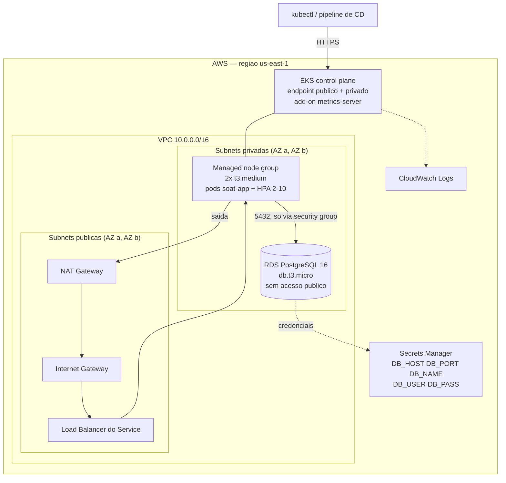
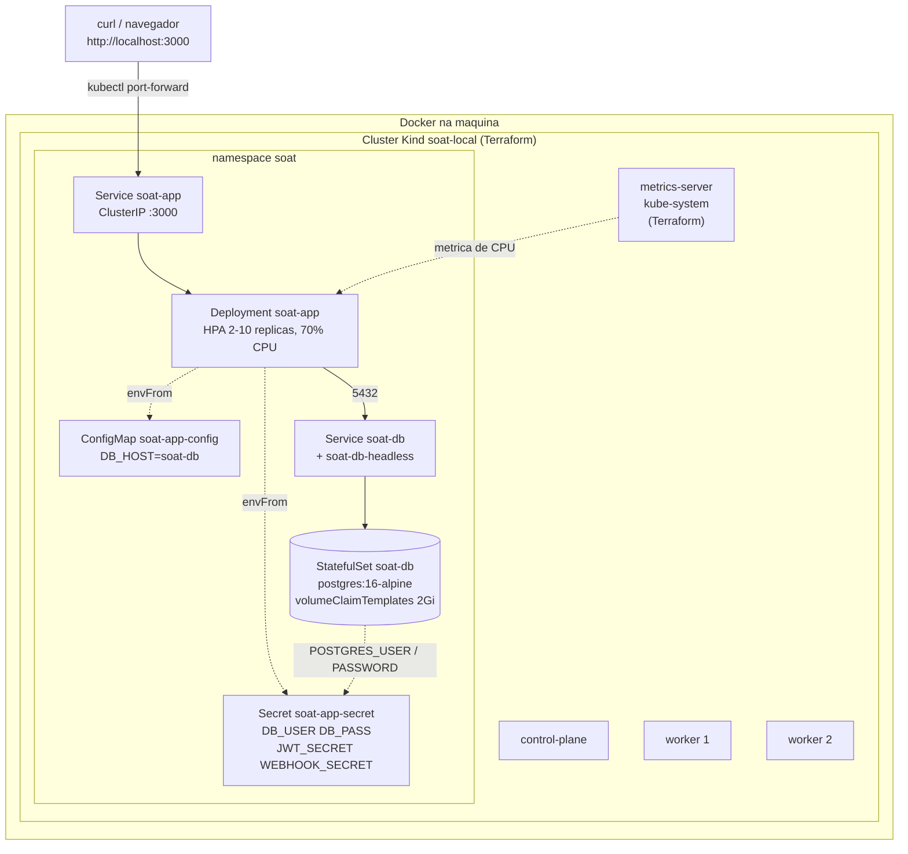

# Infraestrutura (Terraform)

Provisionamento do cluster Kubernetes e do banco de dados do SOAT Tech Challenge — Fase 2.

Existem **dois caminhos completos e independentes**:

| Caminho | Root | Cluster | Banco | Custo |
| --- | --- | --- | --- | --- |
| **AWS** | `envs/aws` | EKS com managed node group | RDS PostgreSQL 16 | pago (ver [Custo](#custo-estimado)) |
| **Local** | `envs/local` | Kind, dentro do Docker | StatefulSet dos manifestos em `k8s/` | zero |

Os dois compartilham nada do estado um do outro: cada um tem seu proprio `init`, `plan`, `apply` e `destroy`. O caminho local existe para demonstrar a aplicacao e o HPA escalando sem gastar com AWS; o caminho AWS e a entrega de infraestrutura de verdade.

**O Terraform para onde os manifestos comecam.** Ele entrega cluster, rede, banco gerenciado (na AWS) e `metrics-server`. Quem cria Deployment, Service, HPA, ConfigMap e Secret e o `k8s/` — aplicado depois do `terraform apply`. Os pontos de contato estao em [Contrato com os manifestos](#contrato-com-os-manifestos-k8s).

---

## Estrutura

```
infra/
  README.md
  bootstrap/                  # cria o backend remoto (S3 + DynamoDB). Roda uma vez.
    main.tf  variables.tf  outputs.tf  terraform.tfvars.example
  modules/
    network/                  # VPC, subnets publicas/privadas, IGW, NAT, rotas
    k8s/                      # EKS: control plane, OIDC, node group, add-ons
    database/                 # RDS PostgreSQL, subnet group, SG, Secrets Manager
  envs/
    aws/                      # raiz do ambiente AWS (dev | prod)
      main.tf  variables.tf  outputs.tf  providers.tf
      terraform.tfvars.example  backend.hcl.example
    local/                    # raiz do ambiente local (Kind)
      main.tf  variables.tf  outputs.tf  providers.tf
      terraform.tfvars.example
```

### Por que `envs/` em vez de um `main.tf` na raiz de `infra/`

A issue sugeria `infra/main.tf`, `infra/variables.tf`, `infra/outputs.tf` e `infra/providers.tf` na raiz. Isso funciona para **um** ambiente. Com dois, nao fecha:

- `terraform init` e por diretorio. Um root unico obrigaria a configurar os providers `aws` **e** `kind`/`kubernetes`/`helm` na mesma execucao — e o provider `aws` exige credencial valida mesmo quando todos os recursos AWS estao com `count = 0`.
- Backends sao por root. O caminho AWS precisa de S3 remoto; o local precisa de state em disco, porque descreve um cluster que vive no Docker de uma maquina so.

Entao `envs/aws/` e `envs/local/` sao os roots — cada um com os quatro arquivos que a issue pediu — e `modules/` guarda o que de fato e reutilizavel.

---

## Diagrama

### AWS



O security group do RDS tem **uma unica regra de entrada**: porta 5432 a partir do security group que o EKS anexa aos nodes. Nao ha CIDR liberado nem endereco publico — nada fora do cluster alcanca o banco.

### Local (Kind)

Tracejado = criado pelo Terraform. Solido = criado pelos manifestos em `k8s/`.



Duas coisas nao obvias no desenho:

- **Nao ha NodePort nem LoadBalancer.** O Service da aplicacao e ClusterIP, escolha deliberada dos manifestos: um `LoadBalancer` fica `<pending>` para sempre em Kind e faz o apply parecer quebrado. O acesso e por `kubectl port-forward`. Por isso o cluster Kind tambem **nao** declara `extraPortMappings` — nao ha porta de node para mapear.
- **O `metrics-server` esta no Terraform de proposito.** O Kind nao o inclui e ele nao e responsabilidade dos manifestos da aplicacao — e infraestrutura de cluster. Sem ele o HPA fica preso em `<unknown>/70%` e nunca escala, que e a diferenca entre gravar o video da demonstracao e olhar para um HPA parado.

---

## Contrato com os manifestos (`k8s/`)

O Terraform nao aplica manifesto nenhum. Ele entrega o cluster (e, na AWS, o banco) e para. Estes sao os nomes que os dois lados precisam concordar — todos configuraveis por variavel no Terraform, e todos com default igual ao que os manifestos usam:

| Objeto | Nome | Quem cria (local) | Quem cria (AWS) |
| --- | --- | --- | --- |
| Namespace | `soat` | Terraform **e** `k8s/namespace.yaml` (labels identicos, o apply e no-op) | `k8s/namespace.yaml` |
| Deployment da app | `soat-app`, container `app`, imagem `soat-tech-challenge:latest` | manifestos | manifestos |
| Service da app | `soat-app`, ClusterIP `:3000`, porta nomeada `http` | manifestos | manifestos |
| HPA | `soat-app`, `autoscaling/v2`, 2-10 pods, 70% CPU | manifestos | manifestos |
| ConfigMap | `soat-app-config` (`DB_HOST`, `DB_PORT`, `DB_NAME`, `NODE_ENV`, `PORT`, `JWT_EXPIRES_IN`) | manifestos | manifestos, **com `DB_HOST` sobrescrito para o endereco do RDS** |
| Secret | `soat-app-secret` (`DB_USER`, `DB_PASS`, `JWT_SECRET`, `WEBHOOK_SECRET`) | `k8s/app-secret.yaml` | criado a partir do Secrets Manager |
| Banco | StatefulSet `soat-db` + Services `soat-db` / `soat-db-headless` | `k8s/db-deployment.yaml` | **RDS** — os manifestos de banco nao se aplicam |
| `metrics-server` | — | **Terraform** | **Terraform** (add-on do EKS) |

Repare na divisao das variaveis de banco: `DB_HOST`, `DB_PORT` e `DB_NAME` estao no **ConfigMap**; so `DB_USER` e `DB_PASS` estao no **Secret**. O Deployment le os dois com `envFrom`, nessa ordem.

---

## Recursos criados e justificativa

### `modules/network` (AWS)

| Recurso | Por que |
| --- | --- |
| `aws_vpc` | Isolamento de rede. DNS hostnames ligado porque o endpoint do RDS so resolve pelo DNS privado da VPC. |
| Subnets publicas (2 AZs) | Onde ficam o Load Balancer de entrada e o NAT. Recebem as tags `kubernetes.io/role/elb` — sem elas um Service `LoadBalancer` nao encontra onde colocar o ELB. |
| Subnets privadas (2 AZs) | Nodes do EKS e RDS. Nenhum deles recebe IP publico. Duas AZs sao o minimo que o EKS e o DB subnet group exigem. |
| `aws_internet_gateway` | Entrada e saida das subnets publicas. |
| `aws_nat_gateway` + `aws_eip` | Saida da internet para os nodes privados (pull de imagem, chamadas a API da AWS) sem expor entrada. Em `dev` e um so (~US$ 33/mes); em `prod`, um por AZ. |
| Tabelas de rota | Publica aponta para o IGW, privadas para o NAT. |

### `modules/k8s` (AWS)

| Recurso | Por que |
| --- | --- |
| `aws_eks_cluster` | Control plane gerenciado. Endpoint publico **e** privado: o publico e o que permite `kubectl` e o pipeline de CD chegarem de fora da VPC. |
| `aws_eks_node_group` | Managed node group em subnets privadas. `dev` = 2x `t3.medium` (max 4), `prod` = 3x `t3.large` (max 10). O `desired_size` entra em `ignore_changes` — depois do primeiro apply quem manda no numero de nodes e o autoscaler, nao o Terraform. |
| Roles IAM (cluster e node) | Politicas gerenciadas da AWS. A do ECR e **somente leitura**: o node baixa imagem, nunca publica. |
| `aws_iam_openid_connect_provider` | Habilita IRSA (ServiceAccount assumindo role IAM). Nada neste modulo usa, mas criar depois obriga a recriar toda role que dependa dele. |
| `aws_eks_addon` | `vpc-cni`, `coredns`, `kube-proxy` e **`metrics-server`**. O ultimo e pre-requisito do HPA de `k8s/app-hpa.yaml`. |
| `aws_cloudwatch_log_group` | O EKS cria este log group sozinho, com retencao infinita. Criando aqui, a retencao fica controlada (7 dias em dev, 30 em prod). |

### `modules/database` (AWS)

| Recurso | Por que |
| --- | --- |
| `aws_db_instance` | PostgreSQL 16, a mesma major do `postgres:16-alpine` do `docker-compose.yml` e do StatefulSet dos manifestos. `db.t3.micro` single-AZ em dev; `db.t3.small` Multi-AZ em prod. Storage sempre criptografado. |
| `aws_db_subnet_group` | Prende a instancia as subnets privadas. |
| `aws_security_group` + regra de entrada | Porta 5432 a partir do security group dos nodes do EKS, e so. |
| `random_password` | A senha e **gerada**, nunca escrita em `.tf` ou `.tfvars`. |
| `aws_secretsmanager_secret` | Guarda `DB_HOST`, `DB_PORT`, `DB_NAME`, `DB_USER` e `DB_PASS`. E o registro completo do banco; o Secret do Kubernetes consome dele so as duas chaves que sao segredo (ver [Contrato](#contrato-com-os-manifestos-k8s)). |

### `envs/local`

| Recurso | Por que |
| --- | --- |
| `kind_cluster` | Control-plane + 2 workers. Sem `extraPortMappings`: o Service da aplicacao e ClusterIP, nao ha NodePort para mapear. |
| `kubernetes_namespace` | Namespace `soat`, com os mesmos labels de `k8s/namespace.yaml` — o apply dos manifestos por cima e no-op e nao gera drift. |
| `helm_release` metrics-server | Com `--kubelet-insecure-tls`, porque o kubelet do Kind serve metricas com certificado auto-assinado. Aceitavel unicamente porque o cluster e descartavel e roda na maquina de quem desenvolve. |
| Postgres (`enable_postgres`) | **Desligado por padrao.** O banco vem do StatefulSet em `k8s/`. Ver a secao abaixo. |

#### `enable_postgres`: o caminho alternativo

Por padrao o Terraform **nao** cria banco no ambiente local — quem faz isso e `k8s/db-deployment.yaml`, um StatefulSet com `volumeClaimTemplates`, ja aplicado e validado em cluster real. Dois Postgres no mesmo namespace e conflito garantido.

`enable_postgres = true` liga um substituto drop-in dos manifestos de banco: mesmos nomes (`soat-db`), mesmos labels, mesmo Secret `soat-app-secret` com as quatro chaves. Ligando, e **obrigatorio** deixar `db-deployment.yaml`, `db-service.yaml` e `app-secret.yaml` fora do apply.

O unico ganho e `wait_for_rollout`: o `terraform apply` so devolve o controle com o banco aceitando conexao. A perda e maior — Deployment + PVC em vez de StatefulSet + `volumeClaimTemplates`, sem nome DNS estavel por pod. Por isso o default e `false`.

### `bootstrap`

Bucket S3 versionado e criptografado + tabela DynamoDB de lock, para hospedar o state remoto do ambiente AWS. Roda **uma vez**, com state local — nao ha onde guardar o state dos recursos que ainda vao criar o lugar de guardar state.

---

## Pre-requisitos

**Comum**
- Terraform >= 1.6 (ou OpenTofu >= 1.6 — a configuracao e compativel com os dois; onde este README diz `terraform`, `tofu` funciona igual)
- `kubectl`

**Caminho AWS**
- AWS CLI v2 autenticada (`aws sts get-caller-identity` precisa responder)
- Permissoes para criar VPC, EKS, RDS, IAM, Secrets Manager, S3 e DynamoDB

**Caminho local**
- Docker em execucao
- `kind`
- `helm` nao e necessario: o provider Helm do Terraform instala o chart sozinho

---

## Comandos

### Caminho local (Kind) — comece por aqui

```bash
cd infra/envs/local

cp terraform.tfvars.example terraform.tfvars   # opcional: os defaults ja funcionam

terraform init
terraform plan
terraform apply

kubectl config use-context kind-soat-local
kubectl get nodes
kubectl top nodes          # confirma que o metrics-server respondeu
```

Se o `apply` reclamar de contexto inexistente (acontece em maquina onde o Docker demora a subir o cluster), rode o cluster primeiro e depois o resto:

```bash
terraform apply -target=kind_cluster.this
terraform apply
```

Depois do apply, o cluster esta pronto para receber a aplicacao:

```bash
# Da raiz do repositorio. A tag e a mesma do Deployment; o Kind nao enxerga
# o daemon Docker local, dai o `kind load`.
docker build -t soat-tech-challenge:latest .
kind load docker-image soat-tech-challenge:latest --name soat-local

./k8s/apply-all.sh

kubectl -n soat get hpa -w    # nao pode ficar em <unknown>/70%

kubectl port-forward -n soat svc/soat-app 3000:3000
curl http://localhost:3000/health
```

Os comandos exatos, ja com os nomes resolvidos, saem do output:

```bash
terraform output -raw access_instructions
```

Para derrubar tudo:

```bash
terraform destroy
```

> Com `create_namespace = true`, o `destroy` apaga o namespace `soat` inteiro — inclusive o que foi aplicado por `kubectl`. E o comportamento desejado num cluster descartavel, mas nao e obvio.

### Caminho AWS

**Passo 1 — backend remoto (uma vez por conta):**

```bash
cd infra/bootstrap
cp terraform.tfvars.example terraform.tfvars

terraform init
terraform apply

terraform output -raw backend_hcl > ../envs/aws/backend.hcl
```

**Passo 2 — ambiente:**

```bash
cd infra/envs/aws
cp terraform.tfvars.example terraform.tfvars

terraform init -backend-config=backend.hcl
terraform plan
terraform apply    # ~15-20 min: o EKS e o RDS sao lentos para nascer
```

**Passo 3 — acessar o cluster:**

```bash
aws eks update-kubeconfig --region us-east-1 --name soat-tech-challenge-dev-eks
kubectl get nodes
```

Ou, sem mexer no kubeconfig existente:

```bash
terraform output -raw kubeconfig > ~/.kube/soat.yaml
KUBECONFIG=~/.kube/soat.yaml kubectl get nodes
```

**Passo 4 — ligar os manifestos ao RDS.** Na AWS o banco e o RDS, entao os manifestos de banco **nao** sao aplicados, e duas coisas precisam ser reescritas: o `Secret`, que aqui vem do Secrets Manager, e o `DB_HOST` do `ConfigMap`, que nos manifestos aponta para `soat-db`.

```bash
cd infra/envs/aws

kubectl apply -f ../../k8s/namespace.yaml

# ConfigMap primeiro, depois o DB_HOST apontando para o RDS.
kubectl apply -f ../../k8s/app-configmap.yaml
kubectl -n soat patch configmap soat-app-config \
  --type merge \
  -p "{\"data\":{\"DB_HOST\":\"$(terraform output -raw db_address)\"}}"

# Secret: DB_USER e DB_PASS saem do Secrets Manager; JWT_SECRET e
# WEBHOOK_SECRET nao sao do banco e sao gerados aqui.
DB_JSON=$(aws secretsmanager get-secret-value \
  --secret-id "$(terraform output -raw db_secret_name)" \
  --query SecretString --output text)

kubectl -n soat create secret generic soat-app-secret \
  --from-literal=DB_USER="$(jq -r .DB_USER <<<"$DB_JSON")" \
  --from-literal=DB_PASS="$(jq -r .DB_PASS <<<"$DB_JSON")" \
  --from-literal=JWT_SECRET="$(openssl rand -base64 48)" \
  --from-literal=WEBHOOK_SECRET="$(openssl rand -base64 48)" \
  --dry-run=client -o yaml | kubectl apply -f -

# Aplicacao: tudo menos os manifestos de banco e o app-secret.yaml de exemplo.
kubectl apply -n soat \
  -f ../../k8s/app-deployment.yaml \
  -f ../../k8s/app-service.yaml \
  -f ../../k8s/app-hpa.yaml
```

> `k8s/app-secret.yaml` traz placeholders publicos (`change-me-...`) para o fluxo local. Aplicar esse arquivo na AWS por cima do Secret montado acima quebra a conexao com o RDS.

Para expor a API na AWS, troque o `type` do Service `soat-app` para `LoadBalancer` — em cluster cloud o ELB e provisionado de verdade, e as subnets publicas ja tem as tags de descoberta. Em dev, `kubectl port-forward` tambem funciona.

**Derrubar:**

```bash
terraform destroy
```

Em `prod` o `destroy` falha de proposito: `deletion_protection = true` no RDS e `prevent_destroy` no bucket de state. Desligar isso e uma decisao consciente, nao um efeito colateral.

### Ambiente `prod`

O mesmo root, com outra `key` de state e outro `.tfvars`:

```bash
terraform init -backend-config=backend.hcl -backend-config="key=envs/aws/prod/terraform.tfstate"
terraform apply -var-file=prod.tfvars
```

---

## Variaveis

### `envs/aws`

| Variavel | Default | Descricao |
| --- | --- | --- |
| `project` | `soat-tech-challenge` | Prefixo dos recursos e tag `Project`. |
| `environment` | `dev` | `dev` ou `prod`. Escolhe o perfil de dimensionamento e vira a tag `Environment`. |
| `region` | `us-east-1` | Regiao da AWS. |
| `azs` | `[]` | Vazio = duas primeiras AZs da regiao. |
| `vpc_cidr` | `10.0.0.0/16` | CIDR da VPC. Subnets sao derivadas dele. |
| `kubernetes_version` | `1.31` | Versao do control plane. |
| `postgres_version` | `16.4` | Versao do PostgreSQL. |
| `db_name` | `soat_repair_shop` | Igual ao `DB_NAME` do ConfigMap `soat-app-config`. |
| `db_username` | `soat_app` | Usuario master. Nomes previsiveis (`postgres`, `admin`, `root`) sao recusados por validacao. |
| `eks_public_access_cidrs` | `["0.0.0.0/0"]` | Quem alcanca o endpoint publico da API. Restrinja em prod. |
| `node_instance_types` | `null` | Override do perfil. |
| `node_desired_size` / `node_min_size` / `node_max_size` | `null` | Override do perfil. |
| `node_capacity_type` | `null` | Override do perfil. `SPOT` corta ~70% do custo de EC2. |
| `db_instance_class` | `null` | Override do perfil. |
| `extra_tags` | `{}` | Tags adicionais em todos os recursos. |

**Nao existe variavel de senha.** A senha do RDS e gerada por `random_password` e gravada no Secrets Manager.

Perfis por ambiente (`environment`):

| | `dev` | `prod` |
| --- | --- | --- |
| NAT Gateway | 1 compartilhado | 1 por AZ |
| Nodes | 2x `t3.medium`, max 4 | 3x `t3.large`, max 10 |
| Disco do node | 20 GiB | 50 GiB |
| RDS | `db.t3.micro`, single-AZ, 20 GiB | `db.t3.small`, Multi-AZ, 50 GiB |
| Backup do RDS | 1 dia | 7 dias |
| `deletion_protection` | desligado | **ligado** |
| Snapshot final no destroy | pulado | **obrigatorio** |
| Retencao de log | 7 dias | 30 dias |

O default e `dev` porque e o unico que pode ser destruido sem cerimonia. Todo valor perigoso (`deletion_protection`, snapshot final, Multi-AZ) so liga em `prod`.

O teto de nodes em `prod` e 10, o mesmo `maxReplicas` do HPA. Nao e coincidencia: com `requests.cpu: 250m` por pod, 10 replicas cabem folgadas em 3 `t3.large`, e o `max_size` existe para o caso de o Cluster Autoscaler entrar depois.

### `envs/local`

| Variavel | Default | Descricao |
| --- | --- | --- |
| `cluster_name` | `soat-local` | Contexto do kubeconfig fica `kind-soat-local`. |
| `kubeconfig_path` | `~/.kube/config` | Onde o Kind escreve o contexto. |
| `node_image` | `kindest/node:v1.31.0` | Fixa a versao do Kubernetes local. |
| `worker_count` | `2` | Workers alem do control-plane. |
| `namespace` | `soat` | Igual a `k8s/namespace.yaml`. |
| `create_namespace` | `true` | Cria o namespace com os labels dos manifestos. `false` deixa o kubectl criar. |
| `enable_metrics_server` | `true` | Sem ele o HPA nao escala. |
| `metrics_server_chart_version` | `3.12.2` | Versao do chart. |
| `enable_postgres` | **`false`** | O banco vem dos manifestos. `true` liga o substituto do Terraform (ver acima). |
| `postgres_image` | `postgres:16-alpine` | So vale com `enable_postgres = true`. |
| `postgres_storage` | `2Gi` | Igual ao `volumeClaimTemplates` dos manifestos. |
| `db_service_name` | `soat-db` | Precisa ser o `DB_HOST` do ConfigMap. |
| `db_name` / `db_username` | `soat_repair_shop` / `postgres` | Igual ao ConfigMap e ao Secret dos manifestos. |
| `app_secret_name` | `soat-app-secret` | Secret lido via `envFrom` pelo Deployment. |
| `app_service_name` / `app_port` | `soat-app` / `3000` | Usados para montar o comando de `port-forward`. |
| `app_image` | `soat-tech-challenge:latest` | Tag do `kind load docker-image`, igual a do Deployment. |

---

## Outputs

### `envs/aws`

| Output | Uso |
| --- | --- |
| `cluster_name`, `cluster_endpoint`, `cluster_certificate_authority_data`, `cluster_version` | Identificacao e acesso ao cluster. |
| `cluster_security_group_id` | SG dos nodes. E a origem liberada no SG do RDS. |
| `oidc_provider_arn` | Trust policy de IRSA. |
| `db_endpoint` | `host:porta` do RDS. |
| `db_address` | Hostname do RDS. E o valor que substitui `DB_HOST` no ConfigMap. |
| `db_port`, `db_name`, `db_username` | Valores de `DB_PORT`, `DB_NAME`, `DB_USER`. |
| `db_password` | **sensivel.** Prefira o Secrets Manager. |
| `db_secret_arn`, `db_secret_name` | Segredo com o JSON completo de credenciais. |
| `kubeconfig` | **sensivel.** Kubeconfig completo, autenticando via `aws eks get-token`. |
| `kubeconfig_command` | O `aws eks update-kubeconfig` ja montado. |
| `vpc_id`, `public_subnet_ids`, `private_subnet_ids`, `region`, `environment`, `account_id` | Contexto para montar ARNs e para outros stacks. |

### `envs/local`

| Output | Uso |
| --- | --- |
| `cluster_name`, `cluster_endpoint`, `kubectl_context`, `kubeconfig_path` | Acesso ao cluster. |
| `kubeconfig` | **sensivel.** Kubeconfig com certificados de cliente embutidos. |
| `namespace` | Namespace onde aplicar os manifestos. |
| `load_image_command` | O `kind load docker-image` ja montado. |
| `app_port_forward_command` | O `kubectl port-forward` ja montado. |
| `app_url` | `http://localhost:3000`, enquanto o port-forward estiver ativo. |
| `postgres_managed_by` | `k8s-manifests` ou `terraform`, conforme `enable_postgres`. |
| `db_endpoint`, `app_secret_name` | Preenchidos so com `enable_postgres = true`. |
| `access_instructions` | Passo a passo pos-apply, ja com os nomes resolvidos. |

Os outputs sao a interface entre este diretorio e o pipeline de CD: `cluster_name` + `region` bastam para o runner rodar `aws eks update-kubeconfig` e aplicar os manifestos.

---

## Custo estimado

Precos `us-east-1`, on-demand, sem Free Tier, em US$/mes. Sao **estimativas** — a fatura real depende de trafego e transferencia de dados.

### `environment = dev`

| Item | ~US$/mes |
| --- | --- |
| EKS control plane (US$ 0,10/h) | 73 |
| 2x `t3.medium` on-demand | 61 |
| NAT Gateway (1x, hora ligada) | 33 |
| RDS `db.t3.micro` single-AZ | 13 |
| Storage: 20 GiB RDS gp3 + 2x 20 GiB EBS | 6 |
| Secrets Manager (1 segredo) | 0,40 |
| CloudWatch Logs | 1-5 |
| **Total** | **~185-195** |

O EKS sozinho e ~40% da conta e cobra por hora ligada mesmo sem pod nenhum rodando. **Rode `terraform destroy` quando terminar a demonstracao.**

### `environment = prod`

Triplo de nodes maiores, NAT por AZ e RDS Multi-AZ colocam a estimativa em **~US$ 390-420/mes**.

### Como reduzir em dev

- `node_capacity_type = "SPOT"` no `terraform.tfvars` corta ~70% do custo de EC2 (com interrupcao possivel)
- `node_desired_size = 1`
- O caminho local custa **zero** e demonstra a mesma coisa, HPA incluso

---

## State

| Ambiente | Backend | Por que |
| --- | --- | --- |
| `bootstrap` | local | Cria os recursos que hospedam o state remoto. Nao ha onde guardar o proprio state antes deles existirem. |
| `envs/aws` | S3 + DynamoDB | Versionado, criptografado e com lock — o state carrega a senha do RDS e nao pode viver em disco de desenvolvedor nem no Git. |
| `envs/local` | local | O cluster vive no Docker de uma maquina so. State compartilhado nao faria sentido: um `kind delete cluster` feito fora do Terraform ja o invalida. |

O bloco `backend "s3" {}` de `envs/aws` e **parcial** de proposito: nome de bucket e chave mudam por ambiente e nao podem ser interpolados. Vem tudo de `-backend-config=backend.hcl`.

> O Terraform 1.10+ tambem sabe travar direto no S3 (`use_lockfile = true`), tornando a tabela DynamoDB dispensavel. Mantivemos o DynamoDB porque e o que o enunciado pede e funciona em qualquer versao.

---

## Seguranca

- **Nenhuma senha em codigo.** A do RDS e gerada por `random_password` e guardada no Secrets Manager. No ambiente local, os segredos vem de `k8s/app-secret.yaml`, que traz placeholders publicos e documenta como substitui-los antes de qualquer uso real.
- **Banco sem endereco publico.** `publicly_accessible = false`, subnets privadas, e uma unica regra de entrada — porta 5432 a partir do security group dos nodes.
- **Nodes em subnet privada.** Saida via NAT, entrada so pelo Load Balancer.
- **Storage do RDS criptografado**, backup automatico ligado.
- **Bucket de state** versionado, criptografado e com acesso publico bloqueado.
- O `terraform.tfstate` contem a senha do RDS em claro. E por isso que o backend remoto e criptografado, e por isso que `*.tfstate` esta no `.gitignore`.
- O endpoint publico da API do Kubernetes vem aberto (`0.0.0.0/0`) porque e o que faz `kubectl` e o CD funcionarem de cara. **Em prod, restrinja `eks_public_access_cidrs`.**

---

## Tags

Toda a stack AWS recebe, via `default_tags` do provider e tambem explicitamente nos modulos:

```
Project     = soat-tech-challenge
Environment = dev | prod
ManagedBy   = terraform
Repository  = fiap-software-architecture
```

`extra_tags` acrescenta o que for necessario. No ambiente local o Terraform toca poucos objetos Kubernetes, e os que toca usam os mesmos labels dos manifestos (`app.kubernetes.io/name`, `app.kubernetes.io/component`, `app.kubernetes.io/part-of`) — divergir geraria drift no primeiro `kubectl apply`.

---

## Limitacoes conhecidas

- **Nao ha repositorio ECR aqui.** O pipeline de CD precisa de um registry; o caminho mais curto para este projeto e o GHCR, que nao exige recurso AWS nenhum. Se o grupo optar pelo ECR, ele entra como modulo proprio — os nodes ja tem a policy de leitura anexada. O Deployment usa `imagePullPolicy: IfNotPresent` com a tag `soat-tech-challenge:latest`, que funciona com `kind load` mas precisa virar uma referencia de registry num cluster cloud.
- **Nao ha Ingress nem AWS Load Balancer Controller.** A exposicao da aplicacao fica com os manifestos (trocar o Service para `LoadBalancer`). O OIDC ja esta criado, que e o que o controller precisaria.
- **Sem VPC Flow Logs** e sem WAF. Sao custo adicional e nao foram pedidos pelo enunciado.
- **A rotacao da senha do RDS nao esta automatizada.** O segredo existe no Secrets Manager, mas sem `aws_secretsmanager_secret_rotation`. O `password` da instancia esta em `ignore_changes` justamente para que ligar a rotacao depois nao seja revertido no plan seguinte.
- **A ligacao entre o RDS e os manifestos e manual** (o `patch` do ConfigMap e o `create secret` do Passo 4). O caminho certo seria o External Secrets Operator lendo o Secrets Manager, ou o proprio pipeline de CD montando os dois objetos. Fora do escopo desta issue.
